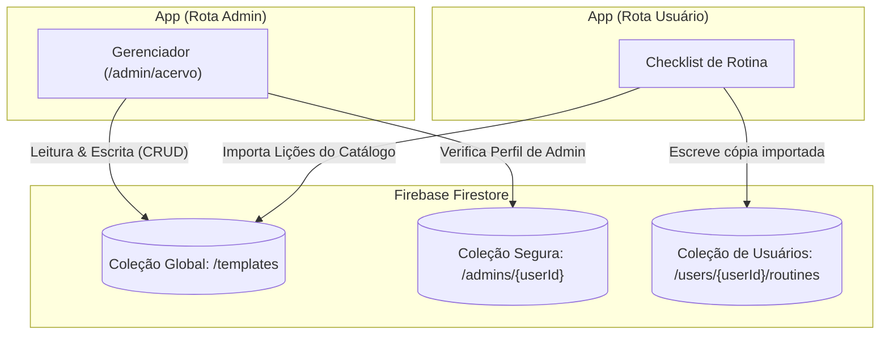
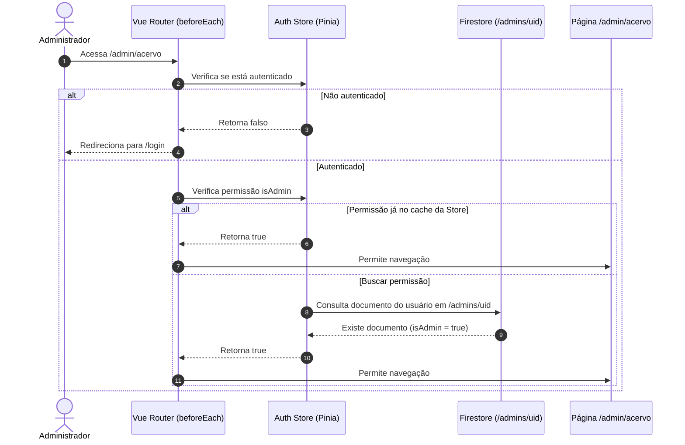

## Context

Atualmente, o aplicativo de treino de canto exige que todos os usuários cadastrem manualmente seus exercícios. Adicionar um acervo de lições pré-definidas no Firebase Firestore permite que novos usuários encontrem rotinas prontas para praticar imediatamente. Para viabilizar a manutenção destas lições sem a necessidade de deploy do código, criaremos um painel administrativo protegido na rota `/admin/acervo` onde administradores autorizados possam gerenciar (criar, atualizar e excluir) os templates de treino.

## Diagrams

### Fluxo de Dados e Permissões do Firestore

### Validação na Guarda de Rota (Vue Router)

## Goals / Non-Goals

### Goals
- Armazenar as lições padrões (templates) no Firestore sob a coleção global `/templates`.
- Criar a rota segura `/admin/acervo` para o gerenciamento (CRUD) dessas lições padrões por administradores do sistema.
- Proteger a escrita na coleção `/templates` utilizando Firebase Security Rules vinculadas à coleção `/admins`.
- Implementar controle de acesso na navegação do Vue Router (`requiresAdmin`).

### Non-Goals
- Criação de uma interface de autoatendimento para que usuários normais criem seus próprios templates públicos (o acervo permanece curado e editável apenas por administradores).

## Decisions

### 1. Modelo de Segurança de Banco (Firestore Rules)
- **Coleção `/admins/{userId}`**: Usaremos uma coleção especial no Firestore contendo documentos cujos IDs são as UIDs dos usuários administradores (ex: `admins/UID_DO_ADMIN`).
- **Regras de Segurança (`firestore.rules`)**:
  - Para `/templates/{templateId}`:
    - Qualquer usuário autenticado pode ler (`allow read: if request.auth != null;`).
    - Somente usuários cujas UIDs existam na coleção de admins podem escrever (`allow write: if request.auth != null && exists(/databases/$(database)/documents/admins/$(request.auth.uid));`).

### 2. Controle de Acesso no Roteador (Vue Router & Pinia)
- No `auth-store.ts`, adicionaremos um estado `isAdmin` que será consultado no Firestore (coleção `/admins/`) no momento em que o usuário se autenticar ou ao tentar acessar uma rota protegida por administrador.
- A rota `/admin/acervo` terá o metadado `requiresAdmin: true`. Na guarda de rota `beforeEach`, se `requiresAdmin` for verdadeiro, o sistema validará se `authStore.isAdmin` é verdadeiro. Caso contrário, redirecionará para a página inicial com alerta de acesso negado.

### 3. Interface de Gerenciamento CRUD
- A tela `/admin/acervo` terá:
  - Tabela com os templates disponíveis.
  - Botão de exclusão (com diálogo de confirmação).
  - Formulário modal Quasar para cadastrar novos templates ou editar um template existente (gerenciando título, plataforma, instruções e checklist dinamicamente).

## Risks / Trade-offs

- **[Risk] Acesso não autorizado se a coleção `/admins` for pública**:
  - *Mitigação*: A coleção `/admins` terá regras rígidas no Firestore onde apenas administradores podem ler e escrever de fora do painel administrativo. Nenhum usuário normal poderá ler dados de `/admins` de terceiros.
- **[Risk] Latência na verificação de Admin**:
  - *Mitigação*: Faremos cache do estado `isAdmin` na Store do Pinia após a primeira consulta durante a sessão para evitar requisições repetidas ao Firestore nas mudanças de rota.
