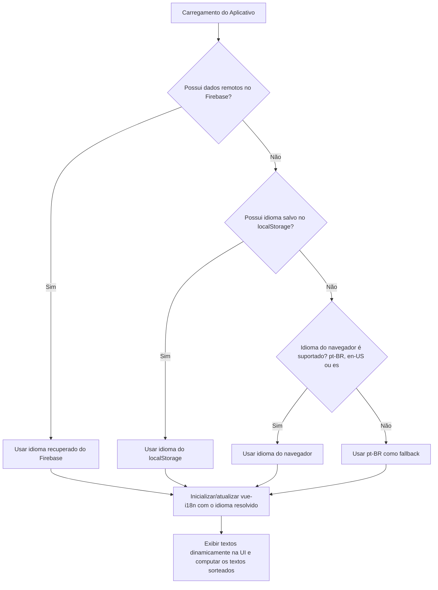

## Context

Atualmente, o aplicativo "Rotina de Canto" exibe todos os textos codificados diretamente nos componentes (hardcoded) em português. Para possibilitar o uso por falantes de outros idiomas e manter a manutenibilidade do código, propõe-se a integração de um mecanismo de internacionalização (i18n). A stack tecnológica do projeto utiliza Vue 3 e Quasar Framework. A solução padrão da indústria para Vue 3 é a biblioteca `vue-i18n` (v9). Além disso, a preferência de idioma deve ser integrada com o Firestore para consistência entre dispositivos do usuário.

Por fim, a store `settings-store` deve ser limpa para conter apenas os estados visuais (cores, dark mode, idioma) e duas propriedades dinâmicas reativas de texto (`appDescription` e `workoutTitle`). Os outros textos se tornam traduções estáticas do i18n, e as duas propriedades reativas de texto serão sorteadas a partir de arrays de traduções no dicionário correspondente ao idioma ativo.

## Goals / Non-Goals

**Goals:**

- Configurar a biblioteca `vue-i18n` no ecossistema do Quasar utilizando as melhores práticas (boot files).
- Criar a estrutura base de traduções para os idiomas `pt-BR` (Português - padrão), `en-US` (Inglês) e `es` (Espanhol).
- Implementar a detecção automática do idioma do navegador do usuário no primeiro acesso.
- Garantir a persistência do idioma escolhido no `localStorage`.
- Adicionar um seletor visual de idioma acessível no cabeçalho do aplicativo (`MainLayout.vue`) e no painel de configurações de temas (`ThemeSettings.vue`).
- Internacionalizar a interface inicial (como o login, menu lateral/superior e cabeçalhos).
- Integrar a preferência de idioma à coleção `users` no Firestore (via `settings-store` do Pinia) para persistir o idioma escolhido na nuvem quando o usuário estiver autenticado.
- Simplificar o `ThemeSettings.vue` para remover as seções de edição de textos da Home e da página de Treino, mantendo esses textos dinâmicos internos da app.
- Corrigir o bug de reatividade na troca de idioma de fora dos componentes Vue.
- Remover as propriedades estáticas de textos (`appTitle`, `workoutSubtitle`, `bannerTitle`, `bannerSubtitle`) da store de settings e do Firestore, migrando-as para chaves estáticas de tradução.
- Implementar sorteio de textos traduzidos para `appDescription` e `workoutTitle` com base em arrays do dicionário ativo.

**Non-Goals:**

- Traduzir a base de dados do Firestore ou conteúdos gerados dinamicamente pelos usuários (apenas a interface de UI do app será traduzida).
- Oferecer personalização de títulos e descrições na tela de configurações.

## System Architecture

Os diagramas abaixo descrevem a lógica de inicialização e de atualização do idioma no aplicativo.

### Fluxo de Inicialização do Idioma (com Firebase e LocalStorage)

## Decisions

### 1. Utilização do `vue-i18n` (v9.x) via Boot File do Quasar com Exportação de Helpers

- **Decisão**: Instalar `vue-i18n` versão `^9.0.0` e integrá-lo criando um boot file (`src/boot/i18n.ts`). A instância criada não será exportada diretamente como `let i18n: any`, pois o carregamento síncrono de módulos pelo ESM/Vite (como o Pinia store) pode ocorrer antes do bootstrap do Quasar concluir, resultando em referências `undefined`. Em vez disso, exportaremos um helper funcional `setLocale(lang)` e um getter `getI18n()` para interagir com a instância criada em runtime.
- **Racional**: Garante isolamento, reatividade robusta e elimina problemas de corrida na inicialização do app (módulos Pinia vs Boot Quasar). A função `setLocale` verifica dinamicamente a presença de `.value` no locale global (`WritableComputedRef`) para atualizar a reatividade de forma compatível.

### 2. Sorteio de Textos Traduzidos Reativos na Store settings-store

- **Decisão**: Criar dois índices aleatórios (`randomDescIndex` e `randomTitleIndex`) gerados uma vez na inicialização da store Pinia. Expor `appDescription` e `workoutTitle` como propriedades `computed` que utilizam a função `tm` (translation messages) do vue-i18n com base nesses índices.
- **Racional**: Isso permite obter um texto sorteado aleatório diferente a cada carregamento do app, ao mesmo tempo em que a troca de idioma altera instantaneamente a tradução correspondente ao índice sorteado de forma totalmente reativa.
- **Alternativas Consideradas**: Sortear nos próprios componentes de view. Rejeitado, para manter a lógica centralizada e evitar duplicação em múltiplos componentes de página.

### 3. Remoção de Propriedades de Configuração Estáticas de Texto da Store Pinia

- **Decisão**: Remover as propriedades `appTitle`, `workoutSubtitle`, `bannerTitle` e `bannerSubtitle` da store, do Firestore e das views locais. Nas views [IndexPage.vue](file:///home/lcds/projects/rotina-canto/src/pages/IndexPage.vue) e [RotinaPage.vue](file:///home/lcds/projects/rotina-canto/src/pages/RotinaPage.vue), referenciar diretamente o método `$t` do i18n com chaves fixas.
- **Racional**: Simplifica e diminui a carga de leitura/escrita do Firestore e do localStorage. Configurações que não necessitam de edição manual do usuário devem ser tratadas puramente via internacionalização estática.

## Risks / Trade-offs

- **[Risco] Incompatibilidade de Tipos com TypeScript** → **Mitigação**: Definiremos os esquemas de tipo das mensagens em `src/boot/i18n.ts` (usando types de `vue-i18n`) ou definindo um schema base a partir do arquivo em português (`pt-BR`) para garantir type-safety nas traduções.

## Migration and Verification

### Passos de Implantação

1. Adicionar `vue-i18n` às dependências.
2. Criar a estrutura em `src/i18n/`.
3. Criar `src/boot/i18n.ts` exportando `setLocale` e `getI18n`.
4. Registrar o boot em `quasar.config.ts`.
5. Atualizar `src/stores/settings-store.ts` para conter apenas `isDark`, `language` e `themeColors` na persistência do Firestore, definindo `appDescription` e `workoutTitle` como getters dinâmicos baseados nos arrays do i18n.
6. Atualizar as views [IndexPage.vue](file:///home/lcds/projects/rotina-canto/src/pages/IndexPage.vue) e [RotinaPage.vue](file:///home/lcds/projects/rotina-canto/src/pages/RotinaPage.vue) para usar `$t` nos títulos estáticos.
7. Integrar o seletor em `src/layouts/MainLayout.vue` e `src/components/ThemeSettings/ThemeSettings.vue`.

### Estratégia de Verificação

- Executar testes locais no navegador alternando idiomas no seletor e no painel de configurações de temas, certificando-se de que a interface é atualizada instantaneamente para inglês e espanhol.
- Verificar que o `document.title` muda de acordo com o idioma ativo.
- Certificar-se de que a descrição na Home e o título na página de Treino exibem frases selecionadas aleatoriamente a cada refresh, mudando a tradução correspondente ao alternar idiomas.
