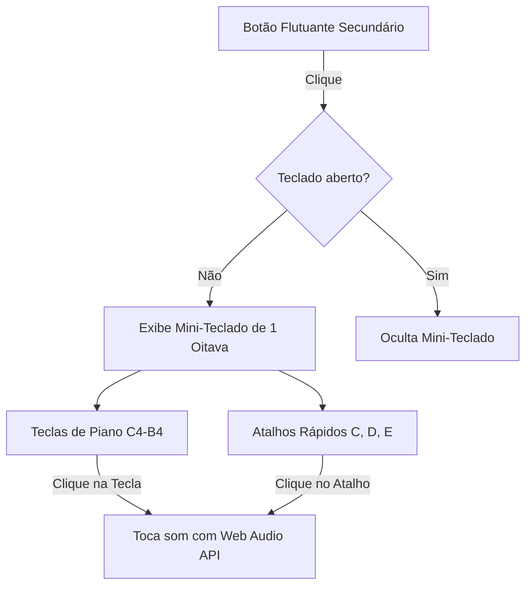

# Specification: reference-keyboard

## ADDED Requirements

### Requirement: Botão Flutuante de Acesso ao Teclado
O sistema SHALL disponibilizar um botão flutuante secundário na interface principal (layout global ou páginas de treino/principal) que permita abrir e fechar o mini-teclado de referência.

#### Scenario: Abrir o mini-teclado
- **GIVEN** que o usuário está na página inicial ou na página de treino
- **WHEN** o usuário clica no botão flutuante secundário de nota/afinador
- **THEN** o sistema SHALL exibir o painel do mini-teclado de referência de forma sobreposta (modal ou painel flutuante).

#### Scenario: Fechar o mini-teclado
- **GIVEN** que o painel do mini-teclado está aberto
- **WHEN** o usuário clica no botão de fechar ou fora do painel
- **THEN** o sistema SHALL ocultar o painel do mini-teclado de referência.

### Requirement: Mini-teclado de 1 Oitava e Notas de Referência
O sistema SHALL renderizar um teclado de 1 oitava (Dó a Si / C4 a B4) e botões de atalho rápido para notas de referência básicas (Dó, Ré, Mi / C, D, E).

#### Scenario: Tocar nota de referência ao clicar em tecla do piano
- **GIVEN** que o painel do mini-teclado está aberto
- **WHEN** o usuário clica na tecla correspondente à nota Dó (C4)
- **THEN** o sistema SHALL reproduzir o som senoidal da frequência de 261.63 Hz correspondente à nota C4 utilizando a Web Audio API.

#### Scenario: Tocar nota de referência pelo botão de atalho rápido
- **GIVEN** que o painel do mini-teclado está aberto
- **WHEN** o usuário clica no botão de atalho da nota Mi (E4)
- **THEN** o sistema SHALL reproduzir o som senoidal da frequência de 329.63 Hz correspondente à nota E4 utilizando a Web Audio API.

## Diagrams

