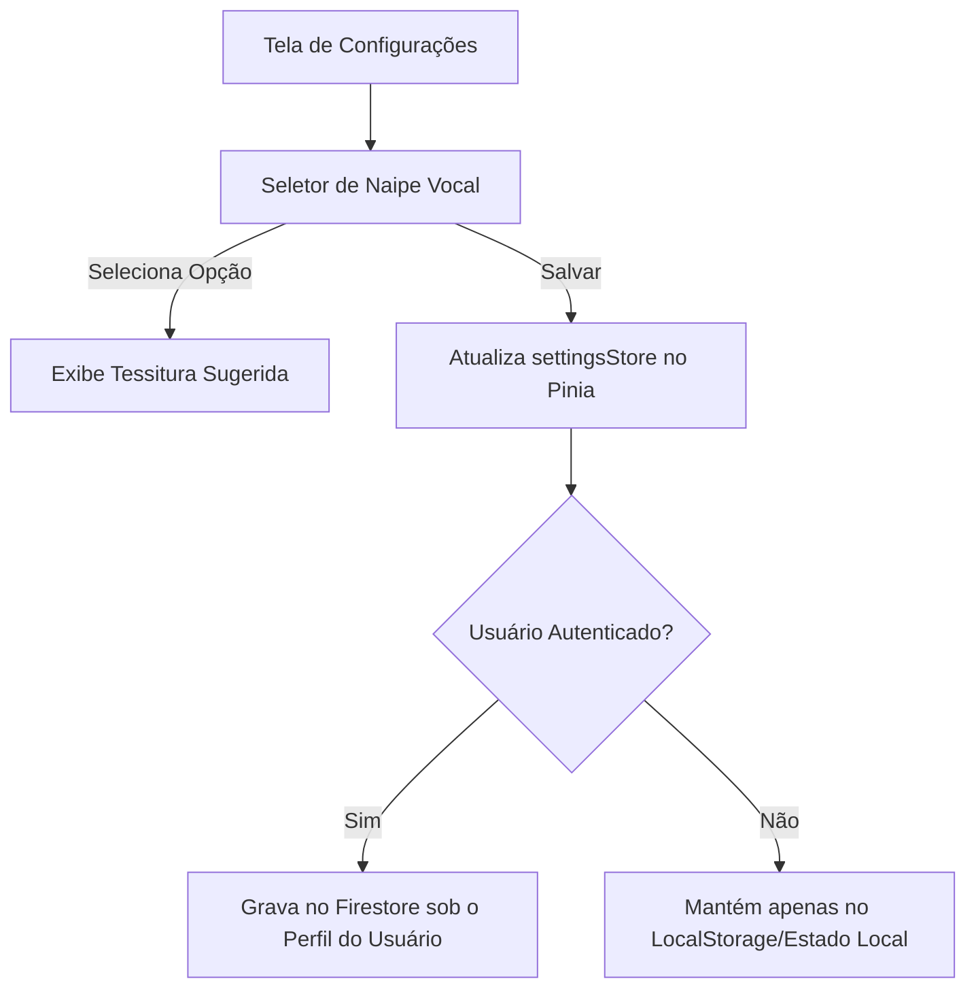

# Specification: vocal-classification

## ADDED Requirements

### Requirement: Seleção de Naipe Vocal
O sistema SHALL permitir que o usuário selecione seu naipe vocal (Soprano, Mezzo-Soprano, Contralto, Tenor, Barítono, Baixo) nas configurações ou no cadastro.

#### Scenario: Selecionar e salvar o naipe vocal
- **GIVEN** que o usuário está na tela de configurações ou de perfil
- **WHEN** o usuário seleciona o naipe "Tenor" no seletor e salva
- **THEN** o sistema SHALL persistir a escolha no estado local (Pinia) e atualizar no banco de dados (Firebase Firestore se o usuário estiver logado).

### Requirement: Exibição de Informações da Tessitura do Naipe
O sistema SHALL exibir uma descrição ou faixa de notas recomendada (tessitura) para cada naipe vocal no momento da seleção.

#### Scenario: Visualizar notas típicas ao selecionar naipe
- **GIVEN** que o usuário está escolhendo um naipe vocal
- **WHEN** o usuário passa o cursor ou seleciona o naipe "Soprano"
- **THEN** o sistema SHALL exibir que a tessitura típica é de C4 a C6.

## Diagrams

