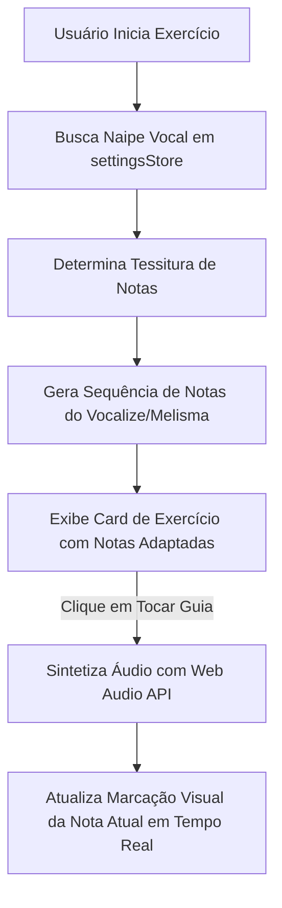

# Specification: vocal-exercises

## ADDED Requirements

### Requirement: Geração de Exercícios Personalizados
O sistema SHALL disponibilizar exercícios dinâmicos do tipo Vocalize e Melisma cujas notas e tonalidades se adaptem ao naipe vocal configurado pelo usuário.

#### Scenario: Exercício gerado para Soprano
- **GIVEN** que o usuário está com o naipe configurado como "Soprano"
- **WHEN** o usuário inicia um exercício de Vocalize
- **THEN** o sistema SHALL gerar a sequência de notas dentro do limite confortável de Soprano (C4 a A5).

#### Scenario: Exercício gerado para Baixo
- **GIVEN** que o usuário está com o naipe configurado como "Baixo"
- **WHEN** o usuário inicia o mesmo exercício de Vocalize
- **THEN** o sistema SHALL transpor a sequência de notas para o limite confortável de Baixo (E2 a C4).

### Requirement: Reprodução de Áudio Guia
O sistema SHALL permitir a reprodução sonora das sequências de exercícios (vocalizes/melismas) utilizando sintetizador de áudio (Web Audio API) como guia para o cantor.

#### Scenario: Iniciar reprodução do áudio guia
- **GIVEN** que o card de exercício dinâmico está sendo exibido na página de treino
- **WHEN** o usuário clica no botão "Tocar Guia"
- **THEN** o sistema SHALL reproduzir a sequência de notas arpejadas ou escalas em tempo real, acompanhando com uma marcação visual da nota atual.

## Diagrams

