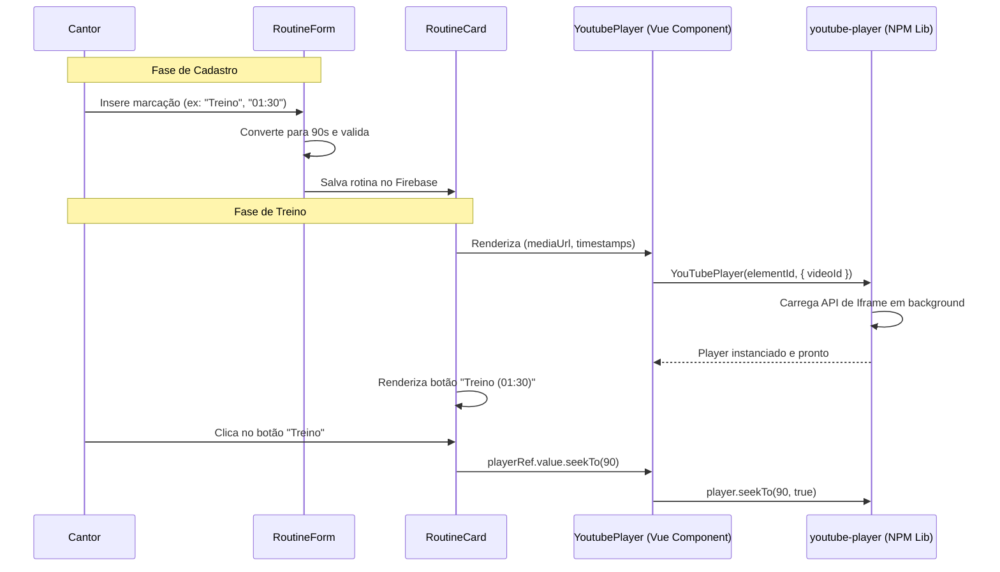

## Context

Para otimizar o fluxo de estudo de canto, o usuário necessita de uma forma rápida de navegar por seções de vídeos longos de treino vocal no YouTube (ex: aquecimentos, vocalizes específicos) sem precisar buscar manualmente na barra de progresso do player. O design técnico visa permitir o cadastro de marcações de tempo (timestamps) personalizadas no formulário da rotina e a renderização de botões rápidos ("Pular para seção") que controlam o player do YouTube via `seekTo()` usando a biblioteca modular `youtube-player`.

## Goals / Non-Goals

**Goals:**
- Estender a interface de dados `RoutineTask` para acomodar timestamps personalizados.
- Desenvolver um componente de gerenciamento de timestamps intuitivo no `RoutineForm.vue` (exibido apenas para a plataforma YouTube).
- Implementar a comunicação bidirecional entre o `RoutineCard.vue` e o player do YouTube (`YoutubePlayer.vue`) para permitir saltos na reprodução ao clicar em botões de atalho.
- Tratar formatos flexíveis de digitação de tempo (MM:SS ou segundos inteiros), convertendo tudo para segundos para armazenamento e consumo pela biblioteca.
- Evitar poluição do escopo global e manipulação direta de scripts no DOM usando o pacote `youtube-player` instalado localmente.

**Non-Goals:**
- Sincronização em tempo real de timestamps entre diferentes usuários ou players.
- Detecção automática de capítulos do YouTube (os capítulos devem ser criados e controlados manualmente pelo cantor).

## Decisions

### 1. Dependência NPM `youtube-player` como Abstração do Player
Decidimos utilizar a biblioteca `youtube-player` para gerenciar a instância do player e a comunicação com o iframe do YouTube.
* **Razão**: A biblioteca gerencia dinamicamente o carregamento interno da API, enfileira comandos até que o player esteja pronto de forma automática e provê uma interface moderna baseada em Promises e eventos (através de `.on()`), dispensando o uso de callbacks globais poluindo a `window` e injeções manuais de scripts no DOM do componente.
* **Alternativa considerada**: Instalação de pacotes específicos de Vue 3 como `vue3-ytframe` ou `@vue-youtube/core`. Rejeitada porque o `youtube-player` é uma biblioteca agnóstica de framework, extremamente estável, leve (baixo bundle size) e que nos dá controle direto sem amarras a ciclo de vida de componentes complexos de terceiros.

### 2. Estrutura de Dados dos Timestamps no Modelo do Card
Decidimos salvar os timestamps como um array de objetos dentro do próprio documento da rotina no Firebase.
* **Modelo**:
  ```typescript
  export interface VideoTimestamp {
    id: string;
    label: string;
    time: number; // segundos totais
  }
  ```
* **Razão**: Agrupar os timestamps diretamente no objeto `RoutineTask` simplifica as chamadas da API do Firebase e evita subcoleções complexas no Firestore.

### 3. Comunicação via `defineExpose` no Componente `YoutubePlayer.vue`
Para acionar o salto de reprodução a partir de botões externos localizados no `RoutineCard.vue`, o componente `YoutubePlayer.vue` exportará a função `seekTo` do player.
* **Razão**: Permite que o `RoutineCard.vue` obtenha a referência do player (`ref="playerRef"`) e chame `playerRef.value.seekTo(seconds)` de maneira direta e tipada.

### 4. Validação e Parse Dinâmico de Formato de Tempo
No formulário de edição, o usuário poderá digitar o tempo como segundos (ex: `90`) ou minutagem tradicional (ex: `01:30`). O formulário converterá automaticamente para segundos usando a expressão regular `^(\d+):([0-5]\d)$` para formato `MM:SS` ou `^\d+$` para segundos puros.

---

## Arquitetura de Componentes e Fluxo de seekTo

O diagrama a seguir exibe as conexões entre o formulário, o card e a biblioteca `youtube-player`:



---

## Risks / Trade-offs

| [Risco] | Mitigação |
| :--- | :--- |
| **API do YouTube indisponível ou bloqueada** | Se o script do YouTube for bloqueado e o `youtube-player` falhar ao inicializar (ou rejeitar a promise), o componente ativa um estado de fallback interno exibindo o `<q-video>` convencional e mantendo os botões apenas informativos. |
| **Múltiplos players na tela gerando conflito de IDs** | A div que recebe a injeção do iframe do YouTube terá um id dinâmico baseado no ID da tarefa (ex: `id="yt-player-" + task.id`), garantindo isolamento total. |

## Migration Plan

1. **Alteração do Model**: Modificar `src/components/models.ts` adicionando `VideoTimestamp`.
2. **Instalação da biblioteca**: Adicionar o pacote `youtube-player` via yarn.
3. **Criação do Player**: Desenvolver `src/components/YoutubePlayer.vue` importando e instanciando o `YouTubePlayer` de forma modular.
4. **Atualização do Form de Rotinas**: Adicionar a seção de lista de timestamps no `RoutineForm.vue` com campos de texto e conversão de tempo, visível apenas se a plataforma for `'youtube'`.
5. **Atualização do Card**: Modificar `RoutineCard.vue` para incluir os botões e chamar a função `seekTo()` exposta pelo `YoutubePlayer.vue`.
