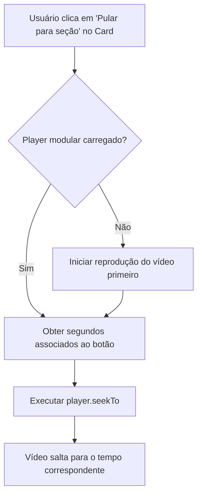

## ADDED Requirements

### Requirement: Condicional de Exibição do Gerenciador de Marcações de Tempo
O sistema SHALL exibir as opções de gerenciamento de marcações de tempo (timestamps) apenas quando a plataforma selecionada para a rotina for "YouTube".

#### Scenario: Tipo YouTube selecionado no formulário
- **GIVEN** que o usuário está no formulário de criação ou edição de uma rotina
- **WHEN** o usuário seleciona a plataforma "YouTube" no seletor de "Tipo de Exercício"
- **THEN** o sistema SHALL exibir a seção de gerenciamento de marcações de tempo (timestamps).

#### Scenario: Outro tipo selecionado no formulário
- **GIVEN** que o usuário está no formulário de criação ou edição de uma rotina
- **WHEN** o usuário seleciona uma plataforma diferente de "YouTube" (como "Vocalize" ou "Udemy")
- **THEN** o sistema SHALL ocultar a seção de gerenciamento de marcações de tempo.

### Requirement: Cadastro e Validação de Marcações de Tempo
O sistema SHALL permitir que o usuário adicione, edite e remova uma lista de marcações de tempo associadas à rotina do YouTube, validando o formato de entrada.

#### Scenario: Adicionar marcação de tempo em formato MM:SS
- **GIVEN** que o usuário está inserindo uma marcação de tempo no formulário
- **WHEN** o usuário preenche o rótulo como "Aquecimento Vocal" e o tempo como "01:30" e clica em "Adicionar"
- **THEN** o sistema SHALL aceitar a entrada, convertê-la internamente para segundos (90 segundos) e adicioná-la à lista temporária.

#### Scenario: Adicionar marcação de tempo em segundos puros
- **GIVEN** que o usuário está inserindo uma marcação de tempo no formulário
- **WHEN** o usuário preenche o rótulo como "Escala Aguda" e o tempo como "245" e clica em "Adicionar"
- **THEN** o sistema SHALL aceitar a entrada como 245 segundos e inseri-la na lista temporária.

#### Scenario: Validação de formato de tempo incorreto
- **GIVEN** que o usuário digita um valor inválido no campo de tempo (como "99:99" ou "invalido")
- **WHEN** o usuário tenta submeter ou validar o formulário
- **THEN** o sistema SHALL exibir uma mensagem de erro informando que o formato deve ser MM:SS ou um número inteiro de segundos.

### Requirement: Atalhos Visuais de Salto de Seção
O sistema SHALL renderizar botões de atalho correspondentes a cada seção configurada diretamente no card da rotina.

#### Scenario: Exibição dos atalhos no card
- **GIVEN** que a tarefa da rotina possui as marcações de tempo `[{ label: 'Intro', time: 10 }, { label: 'Treino', time: 75 }]` cadastradas
- **WHEN** o card da rotina é renderizado na tela de treino
- **THEN** o sistema SHALL exibir botões clicáveis rotulados como "Intro" e "Treino" logo abaixo da área de reprodução do vídeo.

### Requirement: Execução do Salto de Reprodução (seekTo)
O sistema SHALL utilizar a biblioteca encapsulada do player do YouTube para mover a reprodução do vídeo para a minutagem correta ao clicar em um atalho de seção.

#### Scenario: Salto para segundo correspondente
- **GIVEN** que o player modular `youtube-player` está inicializado no card da rotina
- **WHEN** o usuário clica no botão de atalho "Treino" (correspondente a 75 segundos)
- **THEN** o sistema SHALL executar o método `seekTo(75)` no player para mover instantaneamente a reprodução do vídeo para o instante de 1 minuto e 15 segundos.

## Fluxo de Interação do Usuário e API

