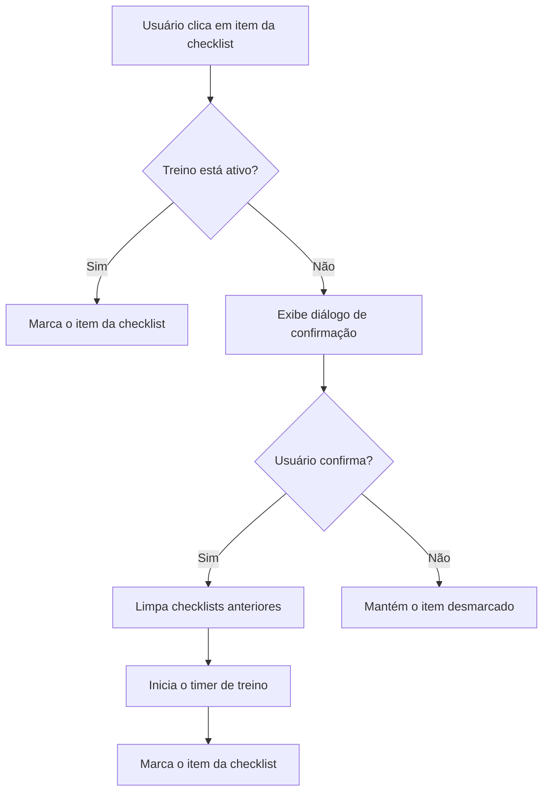

# workout-timer Specification

## Purpose

TBD - created by archiving change fix-treino-completo-horario-errado. Update Purpose after archive.

## Diagrams

## Requirements

### Requirement: Exibição Correta do Tempo do Cronômetro

O sistema SHALL exibir o tempo de treino formatado corretamente em horas, minutos e segundos. Os minutos e segundos SHALL ser limitados entre 0 e 59.

#### Scenario: Exibição de Tempo com Menos de uma Hora

- **WHEN** o tempo de treino decorrido for de 14 minutos e 22 segundos (862 segundos)
- **THEN** o cronômetro SHALL exibir formatado como `14:22`.

#### Scenario: Exibição de Tempo com Mais de uma Hora

- **WHEN** o tempo de treino decorrido for de 1 hora, 14 minutos e 22 segundos (4462 segundos)
- **THEN** o cronômetro SHALL exibir formatado como `01:14:22`.

### Requirement: Restrição de Checklist ao Treino Ativo

O sistema SHALL impedir que itens da checklist de tarefas sejam marcados como concluídos se o cronômetro do treino não estiver ativo. O sistema SHALL solicitar confirmação para iniciar o treino caso o usuário tente interagir com um item desmarcado.

#### Scenario: Tentar marcar item da checklist sem treino ativo

- **WHEN** o cronômetro do treino não estiver ativo e o usuário clicar para marcar um item da checklist
- **THEN** o sistema SHALL exibir um diálogo perguntando se deseja iniciar o treino.

#### Scenario: Confirmar início de treino no diálogo

- **WHEN** o usuário confirmar a inicialização do treino no diálogo de confirmação
- **THEN** o sistema SHALL limpar estados de checklists anteriores, iniciar o cronômetro do treino e marcar o item da checklist clicado como concluído.

#### Scenario: Cancelar início de treino no diálogo

- **WHEN** o usuário cancelar a inicialização do treino no diálogo de confirmação
- **THEN** o sistema SHALL manter o cronômetro inativo e o item da checklist desmarcado.
